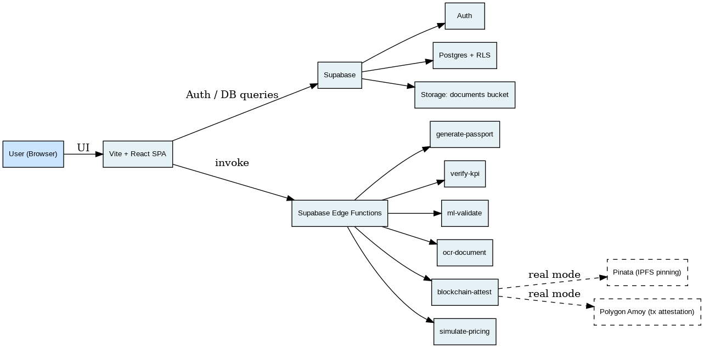

# GreenCred

GreenCred is a web app for collecting, verifying, and sharing ESG KPI performance for sustainability-linked loans.

It supports three roles:

- **Borrowers** submit KPIs and upload supporting documents.
- **Verifiers** review submissions and approve/reject KPIs.
- **Lenders** view borrower portfolios and ESG passports.

The app also supports an optional **blockchain audit trail** (simulated by default; can be made real with Pinata + Polygon Amoy).

---

## Quick links

- Full judge setup: [setup.md](setup.md)

---

## Tech stack (as implemented in this repo)

- Frontend: Vite + React + TypeScript + Tailwind + shadcn/ui
- Backend: Supabase (Auth + Postgres + Storage + Edge Functions)
- Client data: TanStack React Query

---

## Architecture

[Open full-size diagram](public/GreenCred_Architecture.png)

### What runs where

- **Frontend (Vite/React)**: role dashboards, KPI forms, passport viewer/export, calls Supabase APIs and Edge Functions.
- **Supabase Postgres + RLS**: stores borrowers, KPI submissions, verifications, passports, attestations; RLS restricts access by role.
- **Supabase Storage**: stores uploaded evidence files (served to users via signed URLs).
- **Supabase Edge Functions**: server-side logic (passport generation, KPI verification workflow, ML validation scoring, PDF-only OCR extraction, optional blockchain/IPFS attestation).
- **Optional Web3 services**:
  - **Pinata** pins attestation JSON to IPFS (CID)
  - **Polygon Amoy** records an on-chain attestation transaction referencing `(dataHash, cid)`

---

## Run locally

### 1) Install deps

- `bun install`

### 2) Configure env

Create/update `.env`:

- `VITE_SUPABASE_URL=...`
- `VITE_SUPABASE_ANON_KEY=...`

### 3) Start dev server

- `bun run dev`

---

## Key features

- KPI submission with supporting document upload
- Verifier review + approve/reject workflow
- ML validation scoring (benchmarks, anomaly score, confidence)
- ESG Passport generation + shareable link
- Export passport to PDF + QR code
- Document access via signed URLs
- Optional OCR check (PDF embedded-text extraction by default)
- Optional AI analysis for ML validation (if configured)
- Optional blockchain attestation mode

---

## Blockchain attestation

By default, the app can operate in a simulated mode.

To enable real attestation (Pinata pinning + Polygon Amoy transaction), follow:

- [Real blockchain mode](setup.md#5-real-blockchain-mode-optional-for-full-judging)

---

## For judges

If you want the fastest path to evaluate the project:

1. Follow [setup.md](setup.md)
2. Create users for each role (Borrower / Verifier / Lender)
3. Submit → verify → generate passport → export PDF
